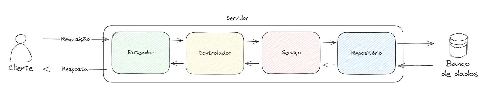

# CRUD API

Uma API para gerenciar um catálogo de produtos, oferecendo funcionalidades de criação, visualização, atualização e exclusão produtos.

## 📕 Sumário

- [🏛️ Arquitetura](#🏛️-arquitetura)
- [🕹️ Funcionalidades](#🕹️-funcionalidades)
- [⛳ Endpoints](#⛳-endpoints)
- [🛠️ Tecnologias](#🛠️-tecnologias)
- [📄 Licença](#📄-licença)

## 🏛️ Arquitetura



- **Roteador:** Recebe requisições HTTP e as encaminha para os controladores correspondentes com base na URL e no método HTTP.
- **Controlador:** Trata das requisições HTTP, processa e valida parâmetros de entrada, chama os serviços apropriados e prepara as respostas para o cliente.
- **Serviço:** Contém a lógica de negócios principal da aplicação e coordena as operações entre os repositórios.
- **Repositório:** Encapsula a lógica de acesso ao banco de dados e abstrai os detalhes específicos do banco de dados.

## 🕹️ Funcionalidades

- Listar produtos
- Adicionar produto
- Editar Produto
- Excluir Produto

## ⛳ Endpoints

### Listar produtos

Retorna uma lista de todos os produtos disponíveis no catálogo.

- URL: `/produtos`
- Método HTTP: `GET`

### Adicionar produto

Adiciona um novo produto ao catálogo.

- URL: `/produtos`
- Método HTTP: `POST`
- Parâmetros:

```javascript
  {
    name: string,
    description: string,
    price: number
  }
```

### Editar Produto

Atualiza as informações de um produto existente.

- URL: `/produtos/{id}`
- Método HTTP: `PUT`
- Parâmetros:

```javascript
  {
    name: string,
    description: string,
    price: number
  }
```

### Excluir Produto

Remove um produto do catálogo.

- URL: `/produtos/{id}`
- Método HTTP: `DELETE`

## 🛠️ Tecnologias

- NodeJS
- Typescript
- Fastify
- MongoDB

## 📄 Licença

Este projeto é licenciado sob a licença MIT.
